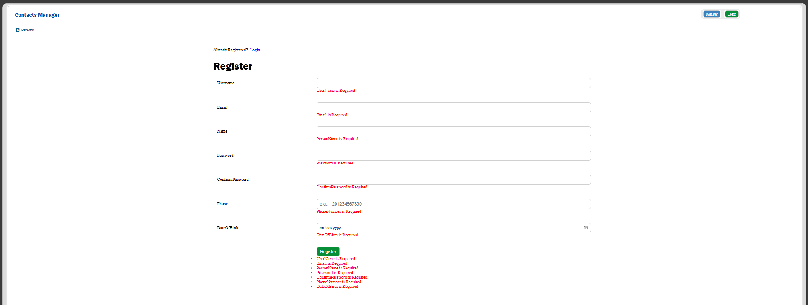
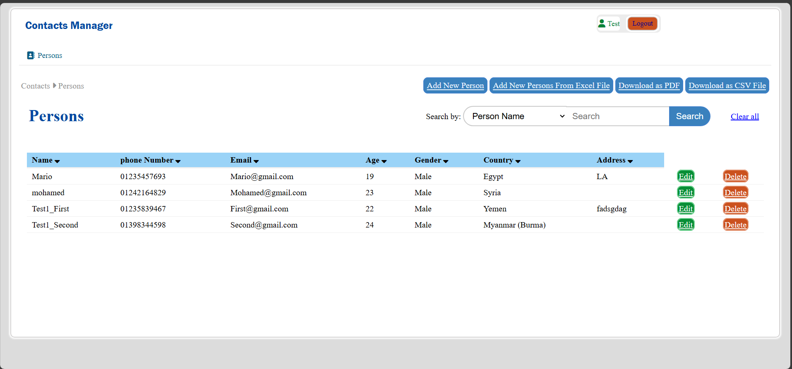
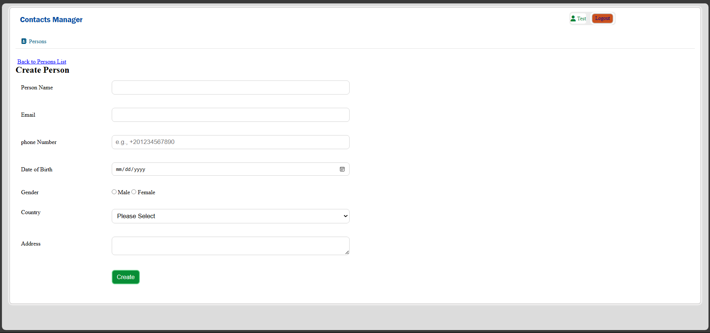
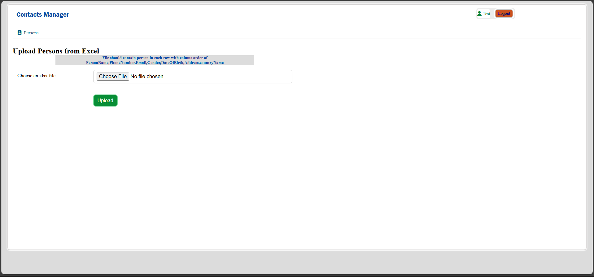

# ContactManagerMVC

A robust Contact Manager application built using the Model-View-Controller (MVC) architectural pattern in C#. This project offers an intuitive interface for managing, viewing, and organizing contact information efficiently.

## Features

- **Add, Edit, and Delete Contacts:** Easily create, update, or remove contact entries.
- **Search and Filter:** Quickly find contacts using keyword search and filters.
- **Responsive UI:** Built with HTML and CSS for a clean, user-friendly interface.
- **MVC Architecture:** Separation of concerns for maintainable and scalable codebase.
- **Data Validation:** Ensures only valid information is saved.

## Technologies Used

- **Backend:** C# (.NET MVC)
- **Frontend:** HTML, CSS
- **Database:** (Specify here, e.g., SQL Server, SQLite, or local storage)

## Getting Started

1. **Clone the repository:**
   ```bash
   git clone https://github.com/AhmedMTwab/ContactManagerMVC.git
   ```
2. **Open the solution** in Visual Studio or your preferred IDE.
3. **Restore dependencies** and build the project.
4. **Configure the database connection** in the configuration file if needed.
5. **Run the application** and access it from your browser.

## Screenshots
#Registeration


#Login


#Main Interface


#Add person


#Get Persons From Excel Sheet



## Contributing

Contributions are welcome! Please open issues or submit pull requests for enhancements or bug fixes.

## License

This project is licensed under the MIT License. See the [LICENSE](LICENSE) file for details.

## Author

- [AhmedMTwab](https://github.com/AhmedMTwab)